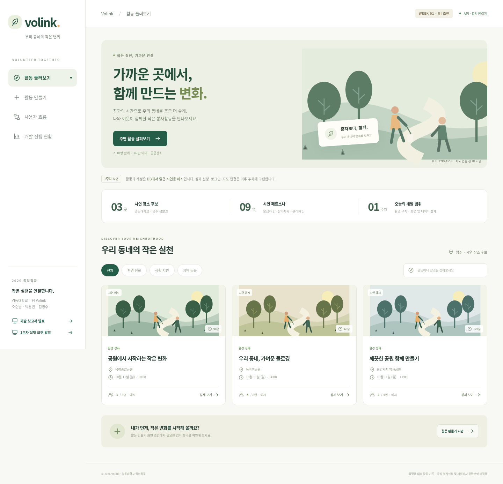

# Volink

**가까운 곳에서, 함께 만드는 작은 변화.**

Volink는 지역 주민이 짧은 봉사활동을 직접 열고, 주변 이웃과 함께 참여하는 웹 플랫폼입니다. **2~10명·3시간 이내** 활동을 중심으로 신청, 정원·대기열, 현장 출석, 완료 기록과 안전 관리를 연결합니다.

> 활동 기록은 **플랫폼 내부 기록**입니다. 공식 봉사실적으로 인정되지 않으며 자원봉사 종합보험이 적용되지 않습니다.

| 프로젝트 | 내용 |
|---|---|
| 학교·조명 | 경동대학교 · Volink |
| 팀원 | 오준원 · 박용빈 · 김병수 |
| 현재 단계 | **1주차 개발 기반·설계·UI 초안 완료** |
| 저장소 | [lov22eee/Volink](https://github.com/lov22eee/Volink) |
| 개발 방식 | 한 명이 한 주차 전체를 맡고, 다음 담당자에게 **main**으로 전달 |

## 빠른 안내

- [지금 동작하는 것](#현재-구현-상태)
- [내 PC에서 실행하기](#실행하기)
- [발표 화면과 보고서](#발표-화면과-보고서)
- [주차별 계획](#주차별-계획)
- [다음 담당자 인수인계](#인수인계)
- [문서와 코드 구조](#문서와-코드-구조)

## 현재 구현 상태

### 지금 동작합니다

- React 화면에서 **Spring Boot → MySQL**로 연결해 시연 데이터를 조회합니다.
- 장소 후보 3곳, 모집자 2·참가자 6·관리자 1의 페르소나, 활동 시안 3건을 확인합니다.
- 홈에서 분야·검색어로 시연 활동을 필터링하고 상세 창을 엽니다.
- 활동 만들기 시안에서 필수 입력, 정원 2~10명, 180분 이내, 안전 안내 확인을 검증합니다.
- 참가자·모집자·관리자의 화면 흐름과 권한 초안을 확인합니다.
- 개발 현황과 **4장짜리 1주차 발표 화면**을 보여줍니다.
- Flyway가 DB 구조와 시연 데이터를 적용합니다. 재실행 시 기존 데이터와 마이그레이션 이력을 보존합니다.

### 아직 구현하지 않았습니다

로그인·JWT, 실제 활동 저장·위험 판정, Kakao 지도·거리 검색, 신청·승인·대기열, QR·위치·시간 체크인, 완료 기록, 신고·관리자 조치, S3, EC2·Nginx·HTTPS 배포.

> **화면 시안과 실제 기능을 구분해 주세요.** ‘입력값 확인’은 활동을 저장하지 않습니다. 페르소나는 로그인 계정이 아닙니다. 그림은 실제 지도가 아닙니다. 장소 좌표와 이용 가능 여부는 2주차에 확인합니다.

### 1주차 화면



더 보기: [활동 만들기](docs/screenshots/week-01-create.png) · [개발 현황](docs/screenshots/week-01-progress.png) · [발표 화면](docs/screenshots/week-01-presentation.png) · [모바일](docs/screenshots/week-01-mobile.png)

## 개발환경

| 구분 | 버전·도구 | 현재 사용 |
|---|---|---|
| 프론트엔드 | React 19.3.0 · Vite 8.3.3 · TypeScript 5.9.3 | 화면·개발 서버·빌드 |
| Node.js | **24.19.0** 검증, 최소 22.12.0 | 프론트 의존성 설치 |
| 백엔드 | Java **21** · Spring Boot **3.5.16** | API·DB 연결 |
| 빌드 | Maven **3.9.11** · Wrapper **3.3.4** | 별도 Maven 설치 불필요 |
| 보안 | Spring Security | 읽기 API 외 접근 제한, JWT는 3주차 |
| DB | MySQL **8.4** · Flyway | Docker 이미지 고정·마이그레이션 |
| 테스트 | JUnit·Testcontainers / Playwright 1.63.0 | 실제 MySQL 통합 / 브라우저 검증 |
| 로컬 도구 | Git · Docker + Compose v2 · Python 3 · curl | DB 실행·설정·연결 확인 |
| 추후 연동 | Kakao 지도 · Amazon S3 · EC2/Ubuntu/Nginx | 아직 설정·배포하지 않음 |

Java 21의 **JDK**를 설치하세요. Docker Desktop(Windows/macOS) 또는 Docker Engine+Compose(Linux)가 실행되어 있어야 합니다. Windows에서는 WSL2 또는 Git Bash를 사용하며, 이 저장소의 통합 실행 스크립트는 Bash·Python 3가 필요합니다. 현재 검증 환경은 Linux입니다.

## 실행하기

### 1. 저장소 준비

처음 사용하는 PC:

```bash
git clone https://github.com/lov22eee/Volink.git
cd Volink
```

이미 내려받은 PC는 **기존 변경을 먼저 확인**합니다.

```bash
git status
git switch main
git pull --ff-only origin main
```

미커밋 변경이나 원격과 갈라진 커밋이 있으면 보존·통합한 뒤 진행하세요. `reset --hard`나 force push로 맞추지 않습니다.

### 2. 로컬 설정과 의존성 설치

저장소 최상위 `Volink/`에서:

```bash
./scripts/setup-env.sh
cd frontend
npm ci
cd ..
```

`setup-env.sh`는 무작위 로컬 DB 비밀번호를 **Git에서 제외된 `.env`**에 생성합니다. 기존 `.env`는 덮어쓰지 않습니다. 직접 설정하려면 `.env.example`의 변수명을 참고하고, 비밀번호를 비워 둔 상태로 DB를 시작하지 마세요.

| 변수 | 기본값·설정 | 설명 |
|---|---|---|
| `MYSQL_DATABASE` | `volink` | DB 이름 |
| `MYSQL_USER` | `volink` | 앱용 DB 사용자 |
| `MYSQL_PASSWORD` | 스크립트가 생성 | 앱용 DB 비밀번호 |
| `MYSQL_ROOT_PASSWORD` | 스크립트가 생성 | 로컬 MySQL 관리 비밀번호 |
| `MYSQL_PORT` | `3307` | PC에서 DB에 접근하는 포트 |
| `SERVER_PORT` | `8080` | 백엔드 포트 |
| `DB_HOST` | 기본 `127.0.0.1` | 별도 DB 이용 시 설정 |
| `JAVA_HOME` | Java 21 JDK | 여러 JDK 설치 시 명시적으로 지정 |

Kakao·AWS·JWT 키는 **1주차 실행에 필요 없습니다**. 개발 서버는 기본적으로 PC의 루프백에만 바인딩합니다. Vite의 API 프록시는 기본 백엔드 `8080`을 사용하므로 포트를 바꾸면 프록시와 검증 스크립트도 함께 조정해야 합니다.

Codex 클라우드처럼 HTTPS 프록시가 있는 환경에서만 추가 실행:

```bash
./scripts/configure-cloud.sh
```

이 명령은 제공된 프록시와 CA를 Maven에 연결합니다. 인증서 검증을 끄지 않습니다. `.cache/`의 로컬 설정은 커밋하지 않습니다.

클라우드 기본 이미지에 Java 실행환경만 있고 `javac`가 없다면, Debian 클라우드 전용 보완 명령으로 전체 JDK를 설치합니다.

```bash
./scripts/install-cloud-jdk.sh
```

서명된 Debian 저장소의 패키지를 검증해 Git에서 제외된 `.tools/`에 추출합니다. 이 프로젝트의 백엔드 스크립트가 해당 JDK를 사용하므로 이후 작업에서도 유지됩니다. 개인 PC에서는 운영체제에 맞는 Java 21 JDK를 설치하세요.

### 3. 전체 서비스 실행

```bash
./scripts/start-dev.sh
./scripts/check-dev.sh
```

스크립트는 MySQL 준비 → 백엔드 빌드·시작 → 프론트엔드 시작 → 연결 확인 순으로 실행합니다. 첫 Maven 설치·빌드는 시간이 걸릴 수 있습니다. `check-dev.sh`는 화면 프록시를 거쳐 실제 API와 DB를 확인합니다.

일반 개발자 PC에서는 브라우저에서 `http://127.0.0.1:5173`에 접속합니다. **클라우드 온보딩 UI는 로컬 주소를 여는 웹 미리보기를 제공하지 않습니다.** 발표는 팀 PC에서 같은 명령으로 실행하세요.

### 따로 실행할 때

DB · 저장소 최상위:

```bash
docker compose up -d --wait db
```

백엔드 · 저장소 최상위:

```bash
./scripts/backend.sh spring-boot:run
```

프론트엔드 · 별도 터미널:

```bash
cd frontend
npm run dev
```

서버 준비 확인은 `GET /actuator/health`의 `UP`, `GET /api/project/status`의 `database: UP`입니다. API 목록과 응답 범위는 [구조 문서](docs/architecture.md#현재-api)를 참고하세요.

### DB 초기화·시연 데이터

첫 백엔드 시작 시 Flyway가 `V1__core_schema.sql`과 `V2__demo_catalog.sql`을 적용합니다. 수동 SQL 실행은 필요 없습니다. DB는 Docker의 `volink_mysql-data` 볼륨에 유지되며 저장소 안에 DB 파일을 만들지 않습니다.

**기존 V1/V2를 수정하지 말고 새 `V3__...sql`을 추가하세요.** DB 비밀번호를 바꾸어도 이미 생성된 DB 사용자 비밀번호가 자동 변경되지는 않습니다. 기존 DB를 보존하면서 사용자 비밀번호를 변경해야 합니다.

### 종료·문제 확인

```bash
./scripts/stop-dev.sh       # 이 스크립트가 시작한 화면·서버만 종료
docker compose stop db      # 필요할 때 DB 중지 · 데이터 보존
```

- 실행 로그: `.run/backend.log`, `.run/frontend.log`
- DB 상태: `docker compose ps`, `docker compose logs db`
- 포트 충돌: 기존 프로세스를 확인한 뒤 이 프로젝트가 시작한 프로세스만 종료
- Maven 다운로드 실패: Java 21, 프록시·CA 설정, 네트워크를 확인
- DB 연결 실패: Docker 상태, `.env`와 기존 DB 사용자 비밀번호 일치 여부를 확인

일반 개발·인수인계에서 DB 볼륨 삭제 명령을 사용하지 않습니다.

## 테스트

Docker를 켜고 다음 명령을 실행합니다.

```bash
# 실제 별도 MySQL 컨테이너로 DB·API·제약 검증
./scripts/backend.sh test

# 프론트 타입 검사 및 배포용 빌드
cd frontend
npm run build
cd ..

# 실행 중인 전체 서비스 기능 확인
./scripts/check-dev.sh
```

브라우저 테스트는 전체 서비스가 실행 중이어야 합니다.

```bash
cd frontend
npx playwright install chromium
npm run test:e2e
```

클라우드의 기존 Chromium을 사용할 때는 설치 대신:

```bash
cd frontend
PLAYWRIGHT_CHROMIUM_EXECUTABLE_PATH=/usr/bin/chromium npm run test:e2e
```

브라우저 테스트는 홈·개설·진행 현황·발표·모바일 캡처를 `docs/screenshots/`에 갱신합니다. UI 수정 후 변경된 캡처도 검토하고 전달하세요. 테스트 결과는 [1주차 검증 기록](docs/verification-week-01.md)에 구분해서 적습니다.

## 발표 화면과 보고서

**이미 제출한 보고서로 발표할 때는 ‘제출 보고서 발표’를 선택하세요.** 보고서 작업기간 2026.09.28~10.05의 구조·권한·UI·데이터 설계 및 다음주 계획을 7장으로 정리했습니다. 기관회원·기관 승인은 설계 시안이며 실제 코드 구현과 구분합니다.

- [발표 HTML · 서버 없이 파일만 열어서 발표](frontend/public/presentations/report-20261006.html)
- [7장 발표 PDF](docs/slides/Volink_제출보고서_발표_20261006.pdf)
- [제출본 대응표·발표 대본·사용 방법](docs/submitted-report-presentation.md)

서비스의 **‘1주차 실행 화면 발표’**는 실제 개발 기반을 보여주는 기존 4장짜리 자료입니다. 개발 현황 페이지에서는 실제 DB의 장소·페르소나를 확인할 수 있습니다.

- [발표 순서와 설명](docs/presentation.md)
- [1주차 보고서 참고 초안 · 제출본과 별도](docs/reports/week-01.md)
- [이후 주차 보고서 템플릿](docs/reports/template.md)

1주차 보고서의 **‘전주까지 개발 현황’은 비워 둡니다**. 완료한 작업만 금주 사항에 쓰고, 미구현 기능을 완성된 것으로 적지 않습니다.

## 주차별 계획

분야는 작업 범위이며, **해당 주차 담당자 한 명이 세 분야 전체를 구현**합니다. 다음 사람이 다음 주차 전체를 이어받습니다. 실제 담당자 이름은 인수인계에서 기록하세요.

| 주차 | 화면 | 서버 | 데이터·테스트 |
|---|---|---|---|
| **1주차** | ☑ 개발환경 구성<br>☑ 사용자별 화면 흐름도<br>☑ 주요 UI 초안·발표 화면 | ☑ 개발환경·DB 구성<br>☑ 핵심 테이블·ERD 초안<br>☑ 역할·권한 초안 | ☑ 장소 후보 3곳 선정<br>☑ 시연 계정 구성 정의<br>☑ 데이터 항목 정리·연결 확인 |
| 2주차 | ☐ 지도·목록 레이아웃 정리<br>☐ 입력·오류 규칙<br>☐ API 화면 요구사항 | ☐ ERD·API 확정<br>☐ 상태 전이·권한표<br>☐ 보안·비용 기준 | ☐ 장소·계정 정의 확정<br>☐ 위험 키워드 초안<br>☐ 구조·데이터 일치 확인 |
| 3주차 | ☐ 활동 개설 화면 연동<br>☐ 위험도 결과 표시<br>☐ 인증·활동 API 연결 | ☐ 인증·JWT·권한<br>☐ 활동 개설 API<br>☐ 위험도 검사 | ☐ 인증·권한 테스트<br>☐ 개설·위험도 테스트<br>☐ 정상·오류 입력 |
| 4주차 | ☐ 주변 지도·목록<br>☐ 반경·날짜·분야 검색<br>☐ 배포 화면·API 확인 | ☐ 위치 검색 API<br>☐ 공간 인덱스<br>☐ 첫 배포·HTTPS | ☐ 위치 검색 테스트<br>☐ REVIEW 비공개·BLOCKED 차단<br>☐ 첫 배포 검증 |
| 5주차 | ☐ 신청·승인<br>☐ 대기·승격 제안<br>☐ 취소·응답 제한시간 | ☐ 정원 잠금·중복 방지<br>☐ 대기열·승격 API<br>☐ 만료·마감 스케줄러 | ☐ 동시 신청·정원 초과<br>☐ 취소·승격·만료<br>☐ 오류·수정 결과 |
| 6주차 | ☐ QR 표시·스캔<br>☐ 체크인 결과 안내<br>☐ 개설→신청→체크인 연결 | ☐ QR 발급·검증<br>☐ 시간·위치 검증<br>☐ 수동 체크인·사유 | ☐ QR 만료·시간·반경<br>☐ 수동 사유 검증<br>☐ 기본 흐름 규칙 테스트 |
| 7주차 | ☐ 완료·마이페이지<br>☐ 신고·관리자<br>☐ 사용성 개선 | ☐ 완료·노쇼·기록<br>☐ 신고·조치·로그<br>☐ 백업·복구 | ☐ 완료·신고·권한<br>☐ 사용성 평가 기록<br>☐ 회귀 테스트 |
| 8주차 | ☐ 화면 오류 수정<br>☐ 최종 시연<br>☐ 발표 자료 | ☐ 장애·배포 점검<br>☐ 운영 매뉴얼<br>☐ 최종 백업 | ☐ 전체 통합 검증<br>☐ 결과 정리<br>☐ 시연 리허설 |

※ 1주차 ‘장소 선정’은 후보 선정이며 실제 좌표·이용 조건 검증이 아닙니다. ‘계정 구성 정의’는 페르소나 9명의 정의이며 로그인 기능 구현이 아닙니다.

※ 계획서의 6주차 전체 흐름 목표와 7주차 완료 구현 일정이 겹칩니다. 현재 6주차 목표는 **개설→신청→체크인**이며 완료까지 앞당길지는 2주차 명세 확정 때 팀에서 결정합니다.

## 인수인계

### 매주 작업을 마치는 순서

1. 이번 주차 전체 범위를 구현하고 화면·API·DB를 함께 확인합니다.
2. 관련 테스트를 실행합니다. 실패·미실행은 이유를 남깁니다.
3. 이 README의 **현재 구현 상태**와 해당 주차의 `☐`를 **확인한 항목만 `☑`**로 바꿉니다.
4. 아래 인수인계에 **완료·실행 결과·미완료·다음 작업·환경 변경·발표 화면**을 적습니다.
5. 발표 화면과 주차 보고서를 갱신합니다.
6. 소스·README·문서·보고서를 **같은 커밋으로 main에 푸시**합니다.

```bash
git status
git pull --ff-only origin main
git add README.md AGENTS.md frontend backend scripts docs compose.yaml .gitignore .env.example
git diff --cached --stat
git diff --cached                # 비밀값·불필요한 파일 포함 여부 검토
git commit -m "feat: complete week N and update handoff"
git push origin main
```

팀원은 동시에 main을 수정하기보다 담당자 교대 시점에 전달합니다. 원격이 바뀌면 기존 작업을 보존하며 통합하고 다시 검증하세요. AI 작업자는 [AGENTS.md](AGENTS.md)도 먼저 읽습니다.

### 1주차 · 2026-10-07

| 항목 | 인수인계 내용 |
|---|---|
| 작업자 | AI 구현 지원, 팀 담당자 이름은 팀에서 기록 |
| 완료 | React·Vite·TS, Spring Boot·Security 기반, MySQL·Flyway, 읽기 API, UI 초안·발표, ERD·권한·흐름, 시연 정의 |
| 실제 연결 | 브라우저→Vite 프록시→Spring Boot→MySQL, 활동 시안·페르소나·장소 조회 |
| 실행·테스트 | [검증 기록](docs/verification-week-01.md)의 실제 실행 명령·결과 확인 |
| DB·환경 변경 | V1 핵심 테이블, V2 시연 전용 데이터, `.env` 로컬 생성, MySQL 볼륨 보존, 기본 포트 5173/8080/3307 |
| 미완료 | 모든 2~8주차 업무 기능, 장소 좌표·이용 조건, 로그인 계정, 실제 지도·AWS·배포 |
| 주의 | 양주 메트로폴 기준 장소 후보. 다른 캠퍼스면 교체. V1/V2 수정 금지. 장소·계정 확정 전 실서비스 데이터로 사용 금지 |
| 다음 작업 | 2주차 전체: API·ERD·상태 전이·권한·오류 규칙·장소 검증·위험 키워드·보안·배포비용 |
| 발표·보고서 | 서비스 ‘1주차 발표 화면’, `docs/presentation.md`, `docs/reports/week-01.md` |

**2026-10-07 추가 인수인계:** 이미 제출한 20261006 HWP를 기준으로 7장 발표 HTML·PDF·대본을 추가했습니다. 서비스 메뉴의 ‘제출 보고서 발표’로 열거나 HTML 파일만 저장해 오프라인 발표합니다. 원본 제출 보고서는 변경하지 않았습니다. 기관회원·기관 승인·기관 주관 활동은 제출본의 설계 항목이며 기존 코드에는 미구현입니다. 다음 담당자는 이 요구사항을 명세에 반영하되 업무 기능을 완료로 체크하지 않습니다. 브라우저 검증 및 출력 결과는 `docs/verification-submitted-report.md`를 확인하세요.

### 2~8주차 · 아직 작업하지 않음

다음 담당자는 해당 주차 작업 후 아래 형식으로 새 항목을 추가합니다. 미작성 상태를 완료로 바꾸지 마세요.

```text
### N주차 · YYYY-MM-DD · 담당자 이름
- 완료사항:
- 실행·테스트 결과: 명령 / 통과·실패·미실행 / 확인한 실제 동작
- DB·환경·설치 변경:
- 미완료·알려진 문제:
- 다음 담당자 작업: 우선순위 / 수정할 코드·문서 / 결정할 사항
- 발표 화면·주차 보고서:
```

## 문서와 코드 구조

```text
Volink/
├── frontend/          React 화면 · 브라우저 테스트
├── backend/           Spring Boot · Flyway · MySQL 통합 테스트
├── scripts/           환경 설정 · 시작/종료 · 연결 확인
├── compose.yaml       로컬 MySQL · 데이터 볼륨
├── docs/
│   ├── architecture.md          구조·ERD·권한·흐름 초안
│   ├── demo-data.md             장소·계정·시연 데이터 정의
│   ├── presentation.md          주차 발표 가이드
│   ├── verification-week-01.md  실제 검증 결과
│   ├── reports/                HWP 복사용 보고서
│   └── screenshots/            실제 실행 화면
├── AGENTS.md          다음 AI 작업자 지침
└── README.md          실행·진행 상황·팀 인수인계
```

**비밀번호, JWT 서명 비밀키, AWS 키, 개인 API 키, 로컬 DB 파일을 GitHub에 올리지 않습니다.** `.env`, 의존성, 빌드 결과, 로그, DB 파일은 제외합니다. 첨부 계획서 원본의 연락처 등 개인정보도 저장소에 복사하지 않았습니다.
