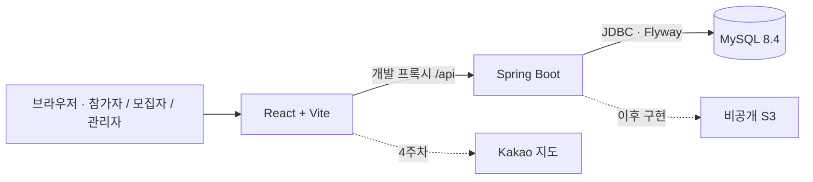
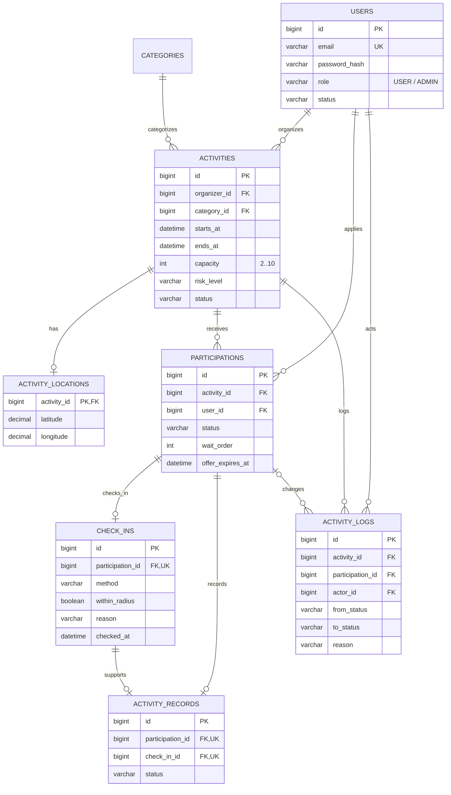
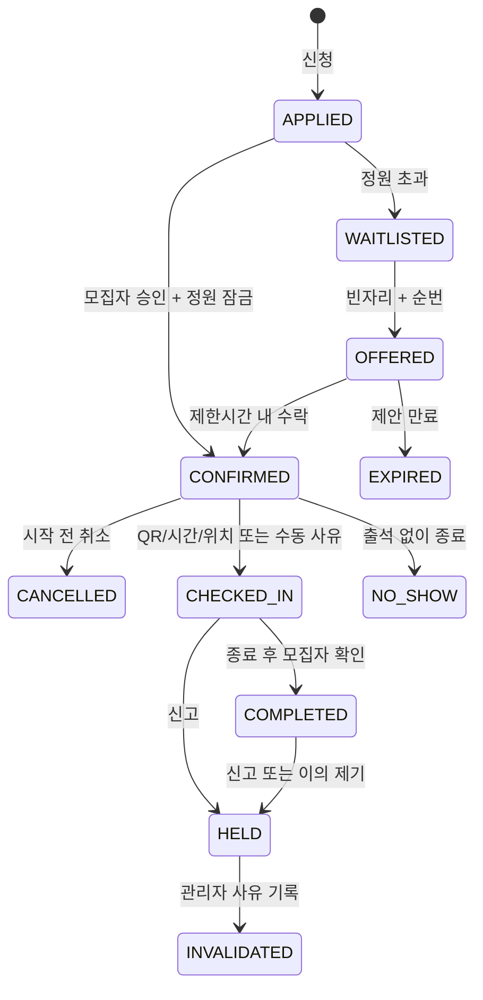
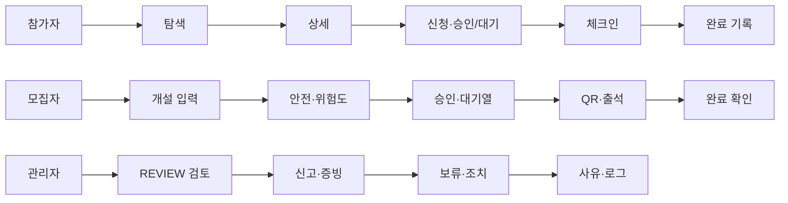

# 구조와 데이터 설계 · 1주차 초안

이 문서는 **확정 명세가 아닌 1주차 설계 초안**입니다. 2주차 담당자가 API, 상태 전이, 권한, 테이블을 확정합니다.

## 시스템 구성

현재 실제 연결: **React → Vite 프록시 → Spring Boot 시연 조회 API → MySQL**.

인증·JWT, 공간 검색, S3 업로드, Nginx·HTTPS 배포는 미구현입니다. Spring Security 의존성과 개발용 읽기 API 접근 규칙만 구성했습니다.

## 핵심 ERD

마이그레이션 파일: `backend/src/main/resources/db/migration/`.

| 구분 | 현재 DB에 적용 | 이후 필요한 보완 |
|---|---|---|
| 정원 | 2~10명 CHECK | 활동 행 잠금·확정 인원 재확인·승격 예약 자리 계산 |
| 활동 시간 | 0분 초과~180분 CHECK | 주간·공공장소 규칙 및 위험도 검사 |
| 중복 신청 | `(activity_id, user_id)` UNIQUE | 취소 후 재신청의 상태 변경 정책 확정 |
| 체크인 | 신청당 1건, 수동 사유 CHECK | QR 서명·60초·허용 시간·200m·소유권 검증 |
| 완료 | 체크인 FK 및 신청당 1건 | 동일 신청의 체크인인지 검증, 종료 후 처리, 이의 제기 7일 |
| 좌표 | 활동 장소의 위·경도와 범위 CHECK | 4주차 POINT/SRID 4326·공간 인덱스 마이그레이션 |
| 로그 | 변경 전후·처리자·사유 컬럼 | 서비스 트랜잭션 내 자동 로그 기록 |

**테이블 제약이 있다는 사실은 신청·체크인 기능 구현 완료를 뜻하지 않습니다.** 상태 변경·정원 잠금·소유권 검증 서비스는 이후 구현합니다. 기존 적용 마이그레이션을 수정하지 말고 `V3__...sql`부터 추가합니다.

신고·증빙·회원 제재·관리자 처리·알림·관심 분야 테이블은 2주차 설계에서 확정하고 새 마이그레이션으로 추가합니다. 첫 주에 운영 기능이 완성된 것으로 간주하지 않습니다.

## 역할과 권한

시스템 역할은 `USER`, `ADMIN` 두 가지입니다. **모집자는 자기 활동을 개설한 USER**이며 다른 모집자의 활동 관리 권한이 없습니다. 회원가입에서 ADMIN을 선택할 수 없도록 3주차에 구현합니다.

| 작업 | 참가자 USER | 해당 활동 모집자 USER | ADMIN | 서버 검증 계획 |
|---|---|---|---|---|
| 공개된 LOW·승인된 REVIEW 활동 탐색 | 가능 | 가능 | 가능 | 공개 상태·위험도 |
| 활동 개설 | 가능 | 가능 | 정책 확정 필요 | 계정 상태·입력값·위험도 |
| 본인 신청·취소·기록 | 본인만 | 본인만 | 처리 정책 확정 | 사용자 ID·참가 상태 |
| 신청자 목록·승인·QR 발급 | 불가 | 자기 활동만 | 별도 감사 정책 | `organizer_id`·상태 |
| 수동 체크인·완료 | 불가 | 자기 활동만 | 별도 관리자 조치 | 체크인·종료시각·사유 |
| 위험 활동 검토·신고 처리 | 불가 | 불가 | 가능 | ADMIN·필수 사유·로그 |

현재: `dev/test` 프로필에서 `GET /api/demo/catalog`, `GET /api/project/status` 공개. 건강 확인 API만 전체 프로필에서 공개. 나머지 요청은 거부하며 로그인 API는 없습니다. 운영 프로필로 실제 서비스 배포는 아직 불가합니다.

## 참가 상태 전이 · 구현 예정

보류 전 상태 복원 방식, 거절·재신청, 제안 자리 예약, 대기열 마감 처리, 개설자 정원 포함 여부는 2주차 결정 사항입니다. 대기 제안은 시작까지 24시간 이상이면 6시간, 그보다 가까우면 1시간이며 시작 2시간 전 대기열 마감, 1분 주기 만료 처리를 계획합니다.

## 사용자 화면 흐름

화면 흐름도와 권한은 이 문서에서 확인합니다. 공개 서비스에는 활동 찾기·상세·만들기·내 활동·로그인·회원가입만 표시하며, 연결된 신청·QR 흐름은 아직 없습니다.

## 현재 API

| 요청 | 용도 | 비고 |
|---|---|---|
| `GET /actuator/health` | 실제 DB 포함 건강 확인 | 상세 연결정보 미노출 |
| `GET /api/project/status` | 1주차 상태·DB 확인 | dev/test 전용 |
| `GET /api/demo/catalog` | 장소·페르소나·활동 시안 조회 | dev/test 전용·읽기 전용 |

UI의 분야·문자열·예시 날짜 필터는 이 시연 응답을 화면에서 필터링합니다. 거리·날짜 기반 서버 검색 API와 Kakao 지도는 4주차에 구현합니다.

## 제출 보고서의 회원 유형 보완

20261006 제출본은 일반회원·기관회원·관리자를 구분합니다. 현재 일반/기관 가입 UI와 기관 확인 후 주관 활동 안내만 반영했습니다. 위 USER/ADMIN DB 초안에는 기관 정보·가입 유형·승인 상태가 없으며 2주차에 새 테이블·마이그레이션·API·권한표를 확정해야 합니다. 기관 승인 대기·승인·반려 상태는 서버에서 관리하고 일반회원이나 UI 전환으로 승인 권한을 부여하지 않습니다.
